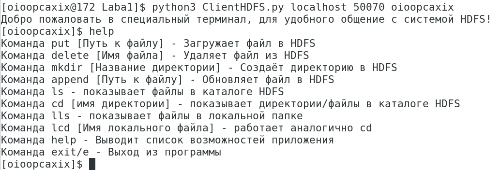

# Клиент для HDFS
Файл следует запускать из консоли <br>
При запуске файла ClientHDFS нужно передать:
<ul> 
<li>Сервер - где происходит запуск</li>
<li>Порт - на котором происходит запуск</li>
<li>Имя пользователя HDFS - говорит само за себя</li>
</ul>

**Пример:**<br>
```python
python3 ClientHDFS.py localhost 50070 oioopcaxix
```
После запуска Вас будет ждать мини-терминал с небольшим набором полезных команд о котором можно узнать вызвав функцию help():<br>



Ещё хочется отметить, что в проекте используются библеотеки: 
<ul>
<li>subprocess - для выполнения терминальных команд и обработки ответов</li>
<li>os - для выполнения функций lcd и lls как и в обычном терминале</li>
<li>sys - для передачи аргументов программе при запуске</li>
</ul>

P.S. Советую выполнять все команды в том виде, как выводит команда help(), в программе присутствует обработка ошибок, но в случае нестандартного ввода, программа может завершиться с ошибкой, так что вся ответственность на Вас, удачных экспериментов :wink: